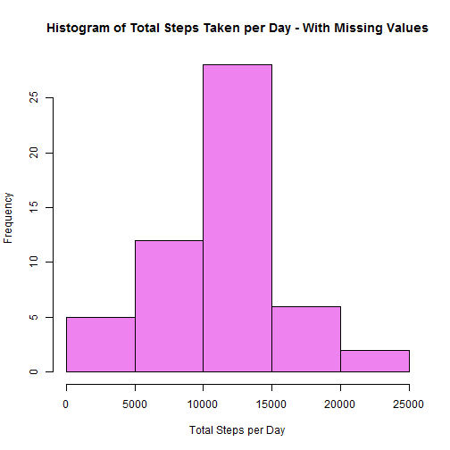
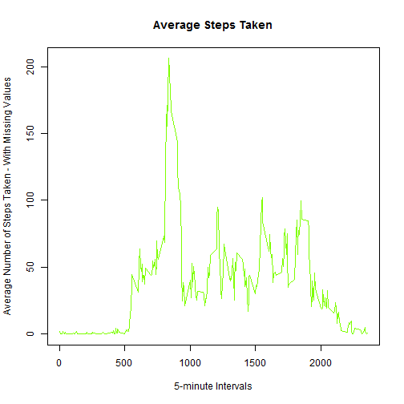
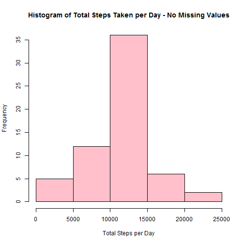

This assignment makes use of data from a personal activity monitoring device. This device collects data at 5 minute intervals through out the day. The data consists of two months of data from an anonymous individual collected during the months of October and November, 2012 and include the number of steps taken in 5 minute intervals each day.

#Data

The variables included in this dataset are:

(1) steps: Number of steps taking in a 5-minute interval 
(2) date: The date on which the measurement was taken
(3) interval: Identifier for the 5-minute interval in which measurement was taken

There are a total of 17,568 observations in this dataset.

#Loading and preprocessing the data


```r
activity <- read.csv("C:/Users/jane.s.turnbull/Documents/R/Reproducible Research/activity.csv")
head(activity)
```

```
##   steps      date interval
## 1    NA 10/1/2012        0
## 2    NA 10/1/2012        5
## 3    NA 10/1/2012       10
## 4    NA 10/1/2012       15
## 5    NA 10/1/2012       20
## 6    NA 10/1/2012       25
```

```r
summary(activity)
```

```
##      steps                date          interval     
##  Min.   :  0.00   10/1/2012 :  288   Min.   :   0.0  
##  1st Qu.:  0.00   10/10/2012:  288   1st Qu.: 588.8  
##  Median :  0.00   10/11/2012:  288   Median :1177.5  
##  Mean   : 37.38   10/12/2012:  288   Mean   :1177.5  
##  3rd Qu.: 12.00   10/13/2012:  288   3rd Qu.:1766.2  
##  Max.   :806.00   10/14/2012:  288   Max.   :2355.0  
##  NA's   :2304     (Other)   :15840
```

#What is mean total number of steps taken per day?

Calculate the total number of steps per day.


```r
tot_steps <- aggregate(steps ~ date, activity, sum)
```

Make a histogram of the total number of steps taken each day.


```r
hist(tot_steps$steps,col = "violet", xlab = "Total Steps per Day", ylab = "Frequency", 
    main = "Histogram of Total Steps Taken per Day - With Missing Values")
```

 

Calculate and report the mean and median of the total number of steps taken per day.


```r
mean(tot_steps$steps)
```

```
## [1] 10766.19
```

```r
median(tot_steps$steps)
```

```
## [1] 10765
```
The mean numberof steps is 10766.19 and the median number of steps is 10765.

#What is the average daily activity pattern?

Make a time series plot of the 5-minute interval and the average number of steps taken, averaged across all days.   Calculate the average number of steps per day first.   Then generate the plot.


```r
mean_steps <- tapply(activity$steps, activity$interval, mean, na.rm = TRUE)
plot(row.names(mean_steps), mean_steps, type = "l", xlab = "5-minute Intervals", 
    ylab = "Average Number of Steps Taken - With Missing Values", main = "Average Steps Taken", 
    col = "chartreuse")
```

 

Which 5-minute interval, on average across all the days in the dataset, contains the maximum number of steps?


```r
max_steps <- names(which.max(mean_steps))
max_steps
```

```
## [1] "835"
```
The 5-minute interval, 835, contains the maximum number of steps on average across all days.

#Imputing missing values

Calculate and report the total number of missing values in the dataset.


```r
summary(activity)
```

```
##      steps                date          interval     
##  Min.   :  0.00   10/1/2012 :  288   Min.   :   0.0  
##  1st Qu.:  0.00   10/10/2012:  288   1st Qu.: 588.8  
##  Median :  0.00   10/11/2012:  288   Median :1177.5  
##  Mean   : 37.38   10/12/2012:  288   Mean   :1177.5  
##  3rd Qu.: 12.00   10/13/2012:  288   3rd Qu.:1766.2  
##  Max.   :806.00   10/14/2012:  288   Max.   :2355.0  
##  NA's   :2304     (Other)   :15840
```
There are 2304 missing values for the variable steps.

Create a new dataset that is equal to the original dataset but with the missing data filled in.


```r
na_indices <- which(is.na(activity))

activity_new<-activity
imputed_values <- mean_steps[as.character(activity_new[na_indices, 3])]
names(imputed_values) <- na_indices

for (i in na_indices) {
    activity_new$steps[i] = imputed_values[as.character(i)]
}
sum(is.na(activity_new))
```

```
## [1] 0
```
There are now no missing values in the new dataset.

Make a histogram of the total number of steps taken each day.  Calculate and report the mean and median total number of steps taken per day.


```r
tot_steps_new <- tapply(activity_new$steps, activity_new$date, sum)

hist(tot_steps_new, col = "pink", xlab = "Total Steps per Day", ylab = "Frequency", 
    main = "Histogram of Total Steps Taken per Day - No Missing Values")
```

 

```r
mean(tot_steps_new)
```

```
## [1] 10766.19
```

```r
median(tot_steps_new)
```

```
## [1] 10766.19
```
The mean and median are both 10766.19.   The impact of imputing the missing values using the mean value impacted the overall mean and median very little.

#Are there differences in activity patterns between weekdays and weekends?

Create a new factor variable in the dataset with two levels - "weekday" and "weekend" indicating whether a given date is a weekday or weekend day.


```r
activity$date <- as.Date(activity$date, "%m/%d/%Y")
day <- weekdays(activity$date)
daylevel <- vector()

for (i in 1:nrow(activity)) {
    if (day[i] == "Saturday") {
        daylevel[i] <- "Weekend"
    } else if (day[i] == "Sunday") {
        daylevel[i] <- "Weekend"
    } else {
        daylevel[i] <- "Weekday"
    }
}
activity$daylevel <- daylevel
activity$daylevel <- factor(activity$daylevel)
```

Make a panel plot containing a time series plot of the 5-minute interval and the average number of steps taken, averaged across all weekday days or weekends. 


```r
stepsByDay <- aggregate(steps ~ interval + daylevel, data = activity, mean)
names(stepsByDay) <- c("interval", "daylevel", "steps")
library(lattice)
xyplot(steps ~ interval | daylevel, stepsByDay, type = "l", layout = c(1, 2), 
    xlab = "Interval", ylab = "Number of steps")
```

 


